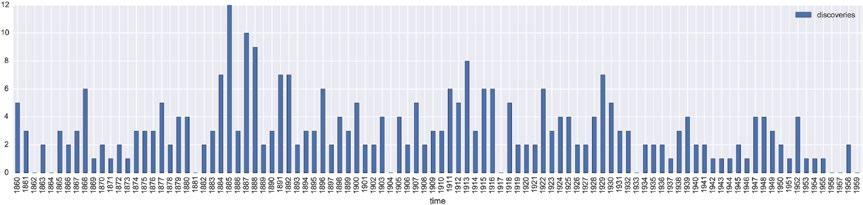
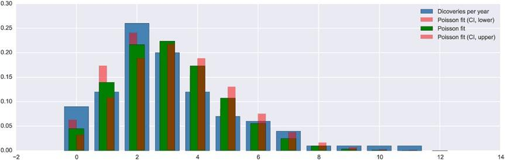

### Poisson Model
**Hãy chạy lệnh bằng iPython**


Để xem làm thế nào để fit dữ liệu sử dụng thư viện `statsmodels`, chúng ta sẽ phân tích kho tập dữ liệu R : `discoveries dataset` chứa số lượng của các discoveries từ 1860 đến 1959. Bởi vì bản chất của dữ liệu nên ta coi rằng tập dữ liệu có thể là phân phối Poisson

Đầu tiên là loading tập dữ liệu sử dụng hàm `sm.datasets.get_rdataset`  và hiện 10 dòng đầu để hiểu format của dữ liệu :
```
import statsmodels.api as sm
import statsmodels.formula.api as smf
import matplotlib.pyplot as plt
import numpy as np
import pandas as pd

dataset = sm.datasets.get_rdataset("discoveries") # loading dữ liệu
df = dataset.data.set_index("time")
df.head(10).T # hiện 10 dòng đầu
```
Chúng ta plot a bar graph của số lượng discoveries mỗi năm.
```
# figsize specifying the (width, height) of the figure canvas in inches
fig, ax = plt.subplots(1, 1, figsize=(16, 4))
df.plot(kind='bar', ax=ax)
```

Từ hình trên, ta không nhìn thấy ngay là phân phối Poisson là không hợp lí, nên để cho hệ thống hơn ta fit dữ liệu vào a Poisson process, tức ta sử dụng class `smf.poisson` và công thức Pasty `discoveries ~ 1`, tức là ta mô hình biến discoveries chỉ với một hệ số chặn (tham số phân phối Poisson).

```
model = smf.poisson("discoveries ~ 1", data=df)
result = model.fit() # fit dữ liệu vào mô hình
print(result.summary()) # hiện một bản tóm tắt
```

Tham số của mô hình, có thể truy cập thông qua thuộc tính của đối tượng `result`, liên quan đến tham số $\lambda$ của phân phối Poisson. Từ đó ta có thể so sánh giá trị count quan sát đc từ histogram với giá trị counts trong lý thuyết (tính được từ biến ngẫu nhiên phân phối Poisson trong thư viện SciPy stats)
```
lmbda = np.exp(result.params)
```
Thêm vào đó ta có thể  ước lượng khoảng tin cậy của tham số  thông qua:
```
result.conf_int()
```
Để đánh giá độ fit của dữ liệu với phân phối Poisson ta tạo biến ngẫu nhiên cho cận trên và cận dưới của khoảng tin cậy cho tham số mô hình
```
X_ci_l = stats.poisson(np.exp(result.conf_int().values)[0, 0])
X_ci_u = stats.poisson(np.exp(result.conf_int().values)[0, 1])
```
Cuối cùng ta graph the histogram of the counts quan sát đc với các hàm xác xuất lý thuyết cho phân phối Poisson tương ứng với tham số mô hình fit và với khoảng tin cậy của nó.

```
v, k = np.histogram(df.values, bins=12, range=(0, 12), normed=True)
fig, ax = plt.subplots(1, 1, figsize=(12, 4))
ax.bar(k[:-1], v, color="steelblue", align='center', label='Dicoveries per year')
ax.bar(k-0.125, X_ci_l.pmf(k), color="red", alpha=0.5, align='center', width=0.25, label='Poisson fit (CI, lower)')
ax.bar(k, X.pmf(k), color="green", align='center', width=0.5, label='Poisson fit')
ax.bar(k+0.125, X_ci_u.pmf(k), color="red", alpha=0.5, align='center', width=0.25, label='Poisson fit (CI, upper)')
ax.legend()
```


Kết quả cho thấy bộ dữ liệu không được miêu tả bởi a Poisson process, vì độ lệch lớn giữa hàm xác suất Poisson và counts quan sát được.
